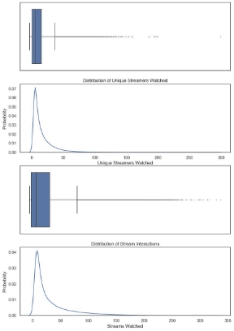
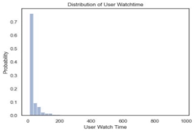
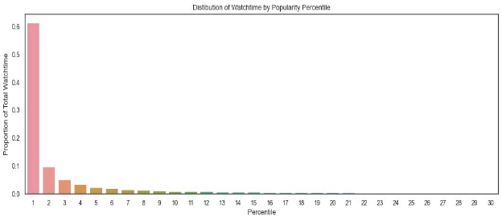
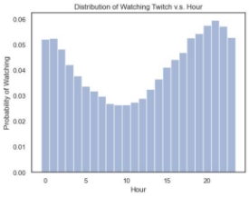
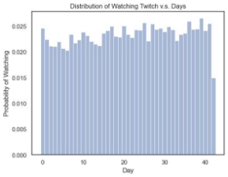
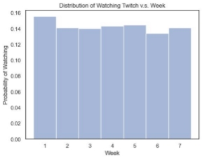

## **Which Twitch is Which?**

## Predicting Twitch User Interaction  

Aritra Das, Luke Taylor, Theodore Hui

[ardas@ucsd.edu](mailto:ardas@ucsd.edu), [lwtaylor@ucsd.edu](mailto:lwtaylor@ucsd.edu), [tchui@ucsd.edu](mailto:tchui@ucsd.edu)  

### Dataset

We are using the twitch dataset found at [https://cseweb.ucsd.edu/~jmcauley/datasets.html](https://cseweb.ucsd.edu/~jmcauley/datasets.html) to predict whether given a random user and time from the testing data, which streamer would the user watch. This data contains all interactions between one hundred thousand viewers and streamers within a 43-day period, with each data point having the start time, stop time, user ID, streamer ID, and stream ID. 

##### Exploratory Data Analysis

Basic statistics: (sample set)

3 million interactions

100,000 unique users

162,625 unique streamers 

For the basic exploratory analysis, I created the probability distribution for the users’ watch time, unique streamers watched, and interactions. I also analyzed how much of the total interactions the top 1% of the top streamers drive twitch’s interaction in this data set.

**Figure 1. Distribution of User Watch Time**

As we can see from the graph above, most interactions between users and streamers are less than 30 minutes. This indicates that people watch individual streams in short bursts, but there also exists a small subset of users who watches a single stream from extended periods of time, longest a person has watched a streamer is 970 minutes

**Figure 2. Distribution of Unique Streamers Watched by Users and Interactions**

The distribution of unique streamers watched by the users shows that most users also mostly watch 15 different streamers. The average user also has 30 different interactions throughout the dataset. This result allows us to be confident that we can use similarity models, and that there will be enough data to create good predictions. This graph also shows that there is an extreme skew in our data, where a very small subset of the users have a lot of interactions and watch many different streamers.

**Figure 3. Distribution of Watchtime by Popularity Percentile**

We decided to graph the percentage of all of Twitch's watch time over the popularity percentile of twitch streamers to see how much watch time and interactions the top one or five percent of twitch streamers drive to the platform. We wanted to know this information to see whether or not our baseline model, recommending the current top channel would be a good model. This finding boosted our confidence for the baseline model as such a large portion of 

watch time. This popularity figure also reinforces the idea that we should not predict streamers that are below the 90th percentile as the probability of a user watching these streamers is less than 10%.

**Figure 4. Distribution of Watch Time v.s. Hour**

With the distribution of watch time by the time of day we see that twitch streamers peak near 9 P.M. in the night and trough at 10 A.M. This insight and trend in the watching habits of users might improve the accuracy of our prediction, as it suggests the relative time of day might play a role on which streamer to recommend.  \
**Figure 5. Distribution of Watch Time v.s. Day**

**Figure 6. Distribution of Watch Time v.s. Week**

Breaking the week into days and averaging watch time per day didn’t yield any interesting results. Watch time per day was evenly distributed. (accounting for the extra day in the 43-day period, 6 weeks + 1 day)

### Predictive Task

For our predictive task, we try to predict which Twitch streamer a user will watch for a given time that they are on the app. The dataset we use contains information on when a user views a Twitch stream and for how long. With this knowledge, we can select certain times we know a Twitch user watches a stream and make a prediction of which streamer the user watched at those moments. Our objective is to use historical information on what a user has watched (and for how long) as well as information on the most popular Twitch streamers (at a given moment and overall) to make our predictions on what a user will watch next. A restraint for this task is availability. Since only a fraction of streamers is streaming on Twitch at a given moment, there’s a limited pool of streams to recommend from. This means that we cannot select any streamer on the app and predict that a Twitch user will watch their stream because they may not even be streaming at a given moment! This adds a degree of complexity to this prediction task compared with other recommender tasks because every stream is a brand-new item being introduced to the app, so it’s difficult to recommend based on the content being released in real-time. Thus, we need to rely on a streamer’s history, the user’s watch history, and the similarities between the user and the users watching the currently available streams to make our predictions on what that user will watch. This prediction task is useful because currently, it is difficult to successfully recommend Livestream content on Twitch because of how little data we have on the vast majority of streamers and users on Twitch, essentially causing our recommender system to encounter the “cold start” start problem very frequently in interactions across our dataset, which ultimately limits to how well we can accurately predict what a user will watch to more active users and streamers. This presents a problem to new streamers on Twitch who are looking to gain a following due to the difficulty of being recommended because of their small amount of historical stream data as well as their small amount of interactions with users and viewers on the platform. 

Accuracy is the best metric for this predictive task. Accuracy suits our predictive task because, for a given interaction, we try to predict the one stream a user will watch, so we are determining whether the one item we retrieve is relevant. Thus accuracy is better than other metrics such as precision and recall because we only return one (not multiple) items. To calculate the accuracy, we calculate the proportion of the predicted streamers that a user will watch at given moments and compare those predictions with the actual streamer username that the user watched. We take the mean of the list of comparisons to produce our accuracy metric on the test data we set aside. The given moments we evaluate our predictions on (sections of the data constitute the test set) depend on the models we used. For simpler models, such as the baseline model and models that we have used in class, the random selection of interactions (and removal from the training dataset) work for evaluation. For more complex models, we needed to use sequential data to model the task, so we simply predicted the last few interactions of every user in the interactions dataset. Thus we have two different approaches with our models to this task: one where we focus on what the user most recently watched and one where we focus on what other users are watching at the moment (which could be more of a relevant prediction task approach for users that have just opened the Twitch app after not watching for a long period of time). 

Thus, the benchmarks for the prediction task depend on the way we approach the task with our models. If we randomly select a streamer from the current pool of streamers streaming at the moment, we get a low bar benchmark of ~0.0 accuracy. A more reasonable benchmark to judge our predictions on is to predict that the user will watch the most popular streamer streaming at the moment. This makes sense as a benchmark for a user that has just logged into the app after a long period of time. The accuracy for this method is ~.04, which is still quite low, but not surprising since this is similar to the proportion of views the most popular streamers on the app get anyway. For our less trivial approach to the predictive task, we used more complex models on sequential data to predict what a user will watch next in time based on their most recent interactions. The benchmark for this method is ~0.48 accuracy, which is simply predicting that the next streamer a user engages with is the last stream engages with. So thus for a model of this matter, we want a more sophisticated model that predicts beyond just simply predicting that a user will watch the last streamer they watched next. 

Encoding the data was a substantial challenge. We wanted our model to be able to use an NLP approach since many advanced NLP models heavily incorporate temporal location in their predictions. To do this, we needed to transform each user’s interactions into a ‘sentence,’ where each ‘word’ is a 10-minute period watching a streamer. Therefore, a user who watched the streamer ‘Ninja’ for an hour would have ‘Ninja’ repeated 6 times in a row in their watch history ‘sentence.’ 

Initially, inactive spaces were also encoded, leading to a vector size of 6,148 for each of the 100,000 users. This vast amount of data was impossible to load in memory as a dense matrix, leading to much experimentation with sparse matrices. The goal of keeping the vector in such a sparse state was to encode the absolute time in the model, potentially capturing periodic/cyclical patterns in watch usage (even capturing streamer patterns such as a stream schedule.) However, such a representation was too cumbersome, so eventually the spaces were removed, leaving only the sequential active history for each user. 

In order to standardize vector length, after each user was transformed into a watch history vector, we used a windowed approach, where feature vectors were created by taking 10 data points as the X and the 11th as the Y. Each vector was then tokenized using a bag of words, tf-idf, and word2vec. This approach banked on the assumption that the most recent interactions were the most impactful (something we found when reading Rappaz et al. and Malm, Friberg.) One pro of using this approach was that it created a very large number of test data (each user now yielded n-10 training data points, n being the number of 10 min streamer interactions) Using a larger history (ex. the last 20 entries) yielded higher accuracies across the board, but also greatly shrank the size of the dataset. Intuitively, this was probably because users who had the most watch time also tended to watch the same streamer(s), making the problem easier to solve naively (just picking the last watched streamer.) We found 10 to be a good mix of historical length (since most users didn’t watch a stream for more than 30 minutes) while still maintaining a healthy data size (5885942 samples) that was more generalizable than longer sample sizes.

### Model 

We tried a set of varying complexity models on our dataset, including Ridge Regression, NLP, and Random Forest. Each model was run through GridSearchCV to optimize hyperparameters. Ridge Regression was by far the fastest, and when optimized had the best accuracy of ~61.3% with a runtime of less than a minute. Although a simple model, naively selecting the last model yielded an accuracy of ~48%, representing a 13 percent improvement. The Multilayer Perceptron approach took much longer, around 6 hours on our machine, and actually performed worse than Ridge, with the best score of 57.5%. This was probably due to a reduction in dataset length (trimmed to half the size to facilitate runtime) Given proper hardware or utilizing a CUDA-compatible library such as PyTorch probably would have allowed for a more comprehensive evaluation of this model (as well as the other complex models.) However, with Random Forest, we were able to predict a probability distribution of streamers. This allowed us to take the predictions one step further by only picking streamers that were actively streaming during the time the prediction was made. This greatly improved the accuracy to 85.8%. Furthermore, the vast majority of errors from the Random Forest classifier were from novel streamers (streamers that had not appeared in the 10 previous histories), which were often picked when none of the previous streamers had been watched (in which case we just predicted the most popular currently streaming streamer. The full pipeline for our most successful model was word2vec -> Random Forest Classifier (probability distribution) -> Currently active streamers filter. 

### Related Literature

**Recommendation on Live-Streaming Platforms: Dynamic Availability and Repeat Consumption**

Jérémie Rappaz, Julian McAuley and Karl Aberer

_RecSys_, 2021

**Viewership forecast on a Twitch broadcast: Using machine learning to predict viewers on sponsored Twitch streams**

Malm, Jonas and Friberg, Martin

_Linköping University, Department of Computer and Information Science_, 2022

[https://www.diva-portal.org/smash/record.jsf?pid=diva2%3A1692795&dswid=538](https://www.diva-portal.org/smash/record.jsf?pid=diva2%3A1692795&dswid=538)

[https://github.com/JRappaz/liverec](https://github.com/JRappaz/liverec)

We used the dataset from Rappaz, McAuley, and Aberer, who used the dataset to predict personalized streamer recommendations at any given moment in time, based on historical interactions as well as currently available streamers. Their model is significantly more complex but came to the conclusion that temporal data, as well as a carefully balanced model of repeat streamers vs novel interactions, was very important in accurately predicting user behavior.

Rappaz, McAuley, and Aberer created their own novel model but also found that SASREC and BERT4REC, an adaptation of the BERT natural language model, were relatively successful baseline models. Both of these models can encapsulate temporal data and be relatively close in accuracy to their novel model, LiveRec.

Malm and Friberg took a streamer-by-streamer approach rather than a user-specific prediction. Working from the streamer side, they built a stream viewership predictor based on historical temporal stream data as well as more stream-specific data, such as stream content (ie what game is being streamed.) They found past viewership had a 95% correlation with future viewership. Their model used a modified multilayer perceptron as well as ridge regression, both of which we would try in our approach.

### Results

Our findings aligned heavily with the 2 other reports we reviewed. User interaction was highly correlated with our predictive outcome. Without incorporating this aspect in our model our testing accuracy dropped by a massive 40% as seen when we got an accuracy of 4% by recommending the most popular streamer at any given vs the 48% when recommending the last stream a user had watched. Without having the user and stream interactions in our model this predictive task does not work. Limiting the answer pool to active streamers was the second most impactful selection factor besides previous watch history. Without this limit being built into the model our model was recommending streamers that were not even streaming and was erroneous. 

A further expansion of our model could possibly incorporate the original (but much larger) data. We could not use this original data as our personal machines were not powerful enough to load such a large amount of data into their memories and were performing their calculations very slowly, but given more time for code optimization and access to stronger computing, we are confident that our method would scale to a larger database. More data might reveal more interesting temporal patterns (like the one seen in figure 4.) over a larger interval of time like day, week, or mounts that is not present in the 100k sample of the Twitch data. Our model lacked a way of recommending new streamers that hadn’t been recently watched, accounting for nearly all our remaining errors. Further expansion could therefore include similarity vectors between streamers to occasionally recommend a new streamer (especially in the case where none of the users recent are currently streaming. 
